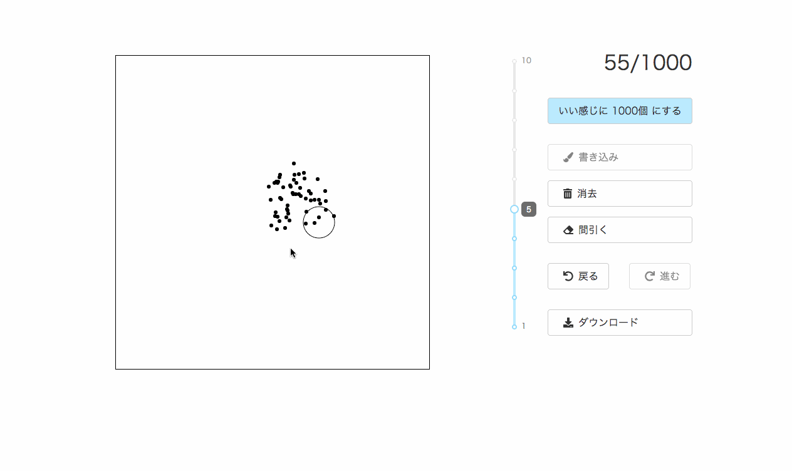

# nice-plotter

いい感じに散布図を作れるツール

javascript + canvas + React で実装します。

DEMO: [https://nice-plot.kawasin73.com/](https://nice-plot.kawasin73.com/)

東京大学理学部情報学科「ユーザーインターフェイス」授業の課題です。

URL: [http://www-ui.is.s.u-tokyo.ac.jp/~takeo/course/2018/ui/assignment/index.htm](http://www-ui.is.s.u-tokyo.ac.jp/~takeo/course/2018/ui/assignment/index.htm)



## 対応する環境

iPad と PC のブラウザから操作することを想定しています。

## 機能

- いい感じにプロット数を 1000個 に調整する機能
- プロットする機能
- プロットを消去する機能
- プロットを一定割合消去し間引く機能
- ポインターの大きさを調整する機能
- 操作履歴のロールバック・フォワード機能
- 作成した散布図を `png` ファイルにしてダウンロードする機能

## 開発

`yarn` と `node` の実行環境が必要です。

```bash
git clone https://github.com/kawasin73/nice-plotter.git && cd nice-plotter
yarn install
yarn start
```

`yarn start` することで開発サーバーが立ち上がり、`http://localhost:3456` にブラウザからアクセスするとページが確認できます。

## デプロイ

Netlify を利用してデプロイしています。

ビルドコマンドは以下の通りです。

```bash
yarn dist
```

`/public` ディレクトリに `index.html` と必要なアセットファイルが生成されます。アセットファイルは、`index.html` から適切にリンクされています。

`/public` ディレクトリを公開することで、このツールを公開できます。

## 設計概略


## LICENSE

MIT
