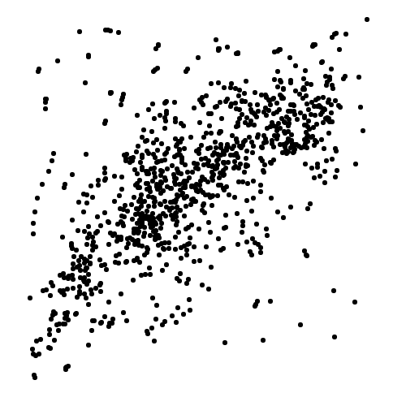

# ユーザーインターフェイス課題レポート

今回の課題のソースコードとドキュメントは、https://github.com/kawasin73/nice-plotter にアップロードしています。

操作概略の動画は、トップページに表示しています。

また、実際のページは、https://nice-plot.kawasin73.com/ にアクセスすることで閲覧・操作できます。

また、このページは、パソコンのWebブラウザと、iPadのブラウザの両方で利用することが可能です。

## デザインの説明

画面を大きく左右2つに分割し、左をキャンバス、右を操作パネルにしました。

このツールの機能は、以下の7つです。

- いい感じにプロット数を 1000個 に調整する機能
- プロットする機能
- プロットを消去する機能
- プロットを一定割合消去し間引く機能
- ポインターの大きさを調整する機能
- 操作履歴のロールバック・フォワード機能
- 作成した散布図を `png` ファイルにしてダウンロードする機能

このツールで一番使われるメインの機能は、いい感じにプロット数を 1000個 に調整する機能です。そのボタンには、色をつけ一番上に配置することで強調しました。

プロットは、手動操作でペンツールを使って行います。ペンツールのモードには、「`書き込み`」「`削除`」「`間引く`」の3つのモードがあり、その3つの状態を切り替えるボタンは近くにまとめて表示しました。

`書き込み` ではクリックやドラッグされた時、範囲の円の中に決められた数の点を一様分布でランダムな位置にプロットします。

`削除` では、範囲の正方形の中の全ての点を削除します。

`間引く` では、クリックやドラッグされた時、範囲の正方形の中の点の 5% を削除します。

ポインターの大きさは、スライダーで10段階に決められるようにしています。
ポインターの大きさとポインターの範囲内のプロット数はそれぞれ別に設定することも可能ですが、2つのスライダーを操作することはユーザーにはわかりにくいと判断したため、1つのスライダーでポインターの大きさとプロット数を決めるようにしました。

間違って操作してしまった時のために一連の操作を履歴で保持しロールバックを可能にしました。

ボタンには全てアイコンとボタンの名前を表示してわかりやすくなるようにしました。

## 操作方法

プロットするときは、まず書き込みモードでポインターのサイズを変えながらざっくりと形を作ります。このときプロットした点の数を意識する必要はありません。
プロットは、画面上のクリックまたはドラッグすることでできます。

「書き込み」「削除」「間引く」のモードを使いながら形を整えたら、「いい感じに1000個にする」ボタンを押します。すると、分布の形を保ちながらプロットの数を 1000個 に増減させます。

この「形を整える」と「いい感じに1000個にする」を繰り返しながら目的となる形に近づけていきます。操作に失敗した場合は、「戻る」ボタンを押すことで元の状態に戻ることができます。

完成した後「ダウンロード」ボタンを押すと、作成した散布図の PNGファイル がダウンロードされます。

## 実験

### まとめ

開発者と被験者2、被験者3の3名で実験を行いました。実験では、まず操作の説明をしない状態で練習課題を行ってもらい、ある程度経ってから操作方法を教えることをしました。

その後、各タスクを実行してもらい、時間を iPhone のストップウォッチで計測しました。

実験が終わった後、操作感について感想をインタービューしました。

実験結果は以下の通りです。それぞれのタスクを実行するのにかかった時間を秒単位で記載しています。

|被験者| 練習 | Task1 | Task2 | Task3 |
|:--|--:|--:|--:|--:|
|開発者|95|25|98|73|
|被験者2|290|62|37|43|
|被験者3|285|64|80|108|
|平均|223|50|71|74|

### 被験者1

- 被験者: 開発者
- 23歳男性 東大生

#### 結果

- 練習: 95 s

- タスク1: 25 s
.png)
- タスク2: 98 s
.png)
- タスク3: 73 s
.png)

### 被験者2

- 20歳男性 東大生

#### 結果

- 練習: 290 s

- タスク1: 62 s
.png)
- タスク2: 37 s
.png)
- タスク3: 43 s
.png)

#### 気づき

練習の時に事前知識なしに UI を触ってもらった時に、「いい感じに 1000個 にする」ボタンをボタンだと認識せずに、課題の内容だと誤解して、ボタンを押してもらえなかった。

タスクの実行中は、履歴のロールバック・フォワード機能は１回しか使っていなかった。

タスクを終わった後にインタビューすると、「いい感じに 1000個 にする」ボタンはとても便利だと絶賛された。

### 被験者3

- 22歳女性 学生

#### 結果

- 練習: 285 s

- タスク1: 64 s
.png)
- タスク2: 80 s
.png)
- タスク3: 108 s
.png)

#### 気づき

練習の時に事前知識なしに UI を触ってもらった時に、「いい感じに 1000個 にする」ボタンをボタンだと認識していなかった。使っていい感がない。使っていいボタンは同じ場所に同じようにまとめられているべきであると感じた。押してはいけないボタンだと思った。仕上げの機能であるか一番最後に配置するべきではないか？

サイズの変更スライダーも、数字だけではわかりにくくて、上が太く、下が細いスライダーにするとサイズを変更するものだと直感的にわかる

クリックしてプロットして、ドラッグしてプロットできることに気づいていなかった。

## 考察

タスクの実行はどれも70秒程度で完了されました。形によって著しく時間がかかることがなかったため、汎用性のあるツールではないかと思っています。

被験者は共通して「いい感じに 1000個 にする」ボタンをボタンだと認識していませんでした。これは、デフォルトで「書き込み」ボタンが選択されており、「書き込み」ボタンより下のボタンを押せるボタンだと認識したためであったようです。

全ての機能について説明すると、「書き込みと間引くことによって形と密度を整える」→「いい感じに1000個にする」を繰り返すサイクルは自然に実行され、想定通りの使い方をされました。しかし、履歴管理機能は使われなかったため、必要はなかったのかもしれません。

被験者の意見を反映して「いい感じに1000個にする」ボタンの位置を修正しました。これがより使いやすいデザインだと考えています。

